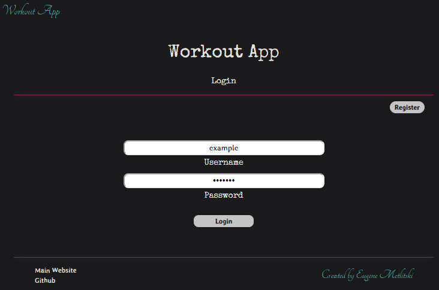
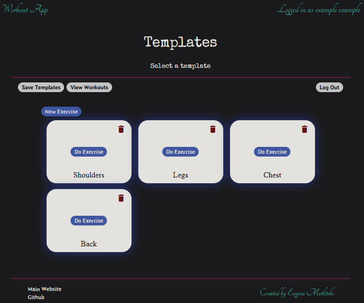
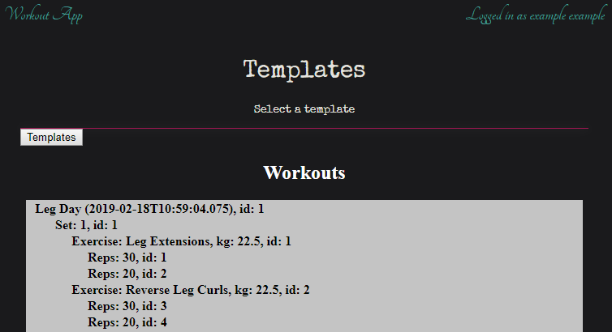

# Workout app

[go to app](http:/eugene-metlitski.com/workout-app)

This app helps keep track of workout sessions. It
records the date of the workout, which exercises
were done and what weights were used.

This app can support multiple users. New users can
register and record their workout sessions.

# Development

This is a front-end portion of the website which was
developed using Angular version 7.1.2.

This website was developed near the start of 2019.

# Instructions: how to use

## Login page

Existing users can login on this page.

There is a user called "example" with a password
"example" available for people to view the app
without signing up.

Feel free to use username "example" and password
"example" or click on the "register" button to sign
up as a new user.

## Templates page

This is the first page user will see after logging
in. New users will not have any templates and will
have to create new templates.

The way this app works is that each exercise
requires to have a template. This template defines
the names of the excercises and the mame of the
template.

Templates can be deleted and new templates can be
created.

When a user clicks on "Do Exercise" button in a
particular template, it will open up that exercise.

## Workout page

On this page a user can define/update the details
of a template and save their workout.

A user can define how many sets there are in this
exercise (by adding/deleting a set), and define the
exercises are done in each set.

Each exercise has an image associated with it (in
future versions, user will be able to upload
excercise image). Each excercise also has a name
and the number of reps that are done (in case
during a particular set a user has done 30 reps for
example then rested and done another 25 reps, this
app allows to record that detail as illustrated in
the image for "Leg Extensions 20kg" exercise).

When the user is done with the excercise, they can
update the template and save the workout. Updating
the template will memorize all the details of this
workout for the next time that the user will open
this template. Saving the workout will save the
details of this workout in the database.

## View workouts

When clicking on the "view workouts" button on the
"Templates" page, all the workouts that the user
has previously done will be retrieved from the
database and displayed.

This page has not beed fully developed yet, but it
is able to retrieve the excercises and show the
details at this point in time.
